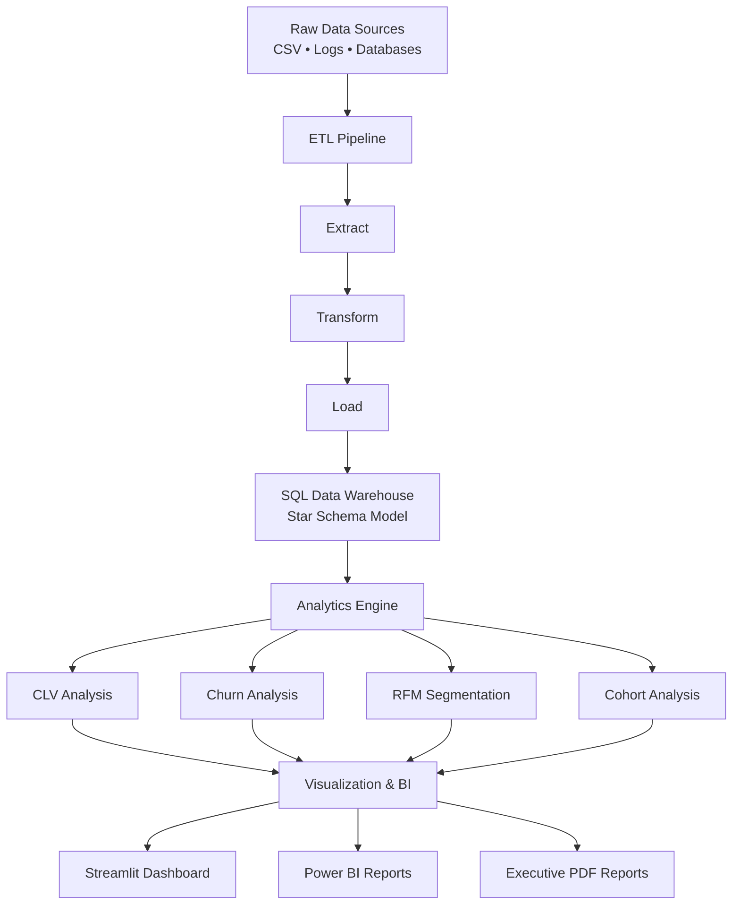
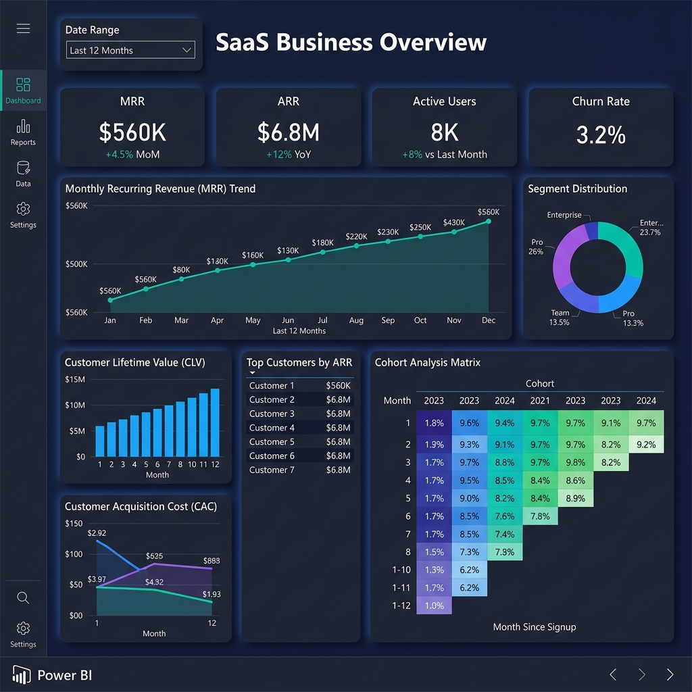
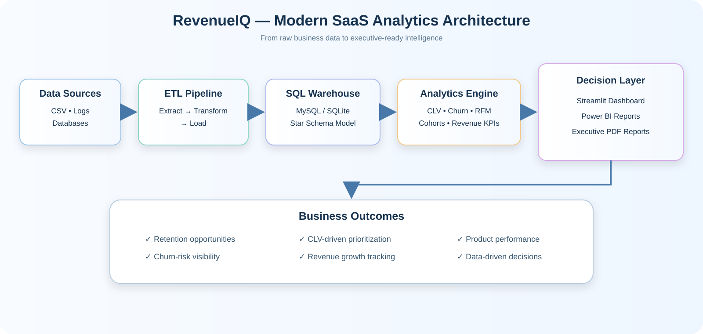

# RevenueIQ — SaaS Business Intelligence & Customer Analytics Platform

> **An end-to-end SaaS analytics platform that transforms raw customer, subscription, and revenue data into actionable business intelligence for retention, growth, and revenue optimization.**

<p align="center">
  <a href="https://github.com/abhi-iitg/revenueiq-saas-business-intelligence.git"></a>
  <a href="https://abhishek-kg-portfolio-pied.vercel.app/"></a>
  <a href="https://www.linkedin.com/in/abhishekkumargond/"></a>
  <a href="mailto:mr.abhishekaa@gmail.com"></a>
</p>

[](https://www.python.org/)
[](https://streamlit.io/)
[](https://powerbi.microsoft.com/)
[](LICENSE)

## Table of Contents

- [Overview](#overview)
- [Business Objectives](#business-objectives)
- [Solution Architecture](#solution-architecture)
- [Key Features](#key-features)
  - [Automated ETL Pipeline](#automated-etl-pipeline)
  - [Customer Analytics](#customer-analytics)
  - [Revenue Analytics](#revenue-analytics)
  - [Cohort Analysis](#cohort-analysis)
  - [Business Intelligence](#business-intelligence)
- [Technology Stack](#technology-stack)
- [Project Structure](#project-structure)
- [KPIs Tracked](#kpis-tracked)
- [Getting Started](#getting-started)
- [Dashboard Preview](#dashboard-preview)
- [Business Impact](#business-impact)
- [Future Enhancements](#future-enhancements)
- [Connect](#connect)
- [License](#license)

## Overview

**RevenueIQ** is an end-to-end Data Analytics and Business Intelligence solution designed to analyze customer behavior, product performance, subscription trends, and revenue growth.

The platform converts raw business data into decision-ready insights through:

- An automated ETL pipeline
- A SQL-based analytical warehouse
- Customer and revenue analytics
- Cohort and retention analysis
- Interactive dashboards
- Executive-ready PDF reporting

The project is designed to support practical SaaS business questions such as:

- Which customers are most valuable?
- Which customers are at risk of churn?
- How is recurring revenue changing over time?
- Which products or plans contribute most to revenue?
- How can customer retention and lifetime value be improved?

## Business Objectives

RevenueIQ focuses on the following business objectives:

1. Analyze customer engagement and subscription behavior.
2. Identify churn patterns and retention opportunities.
3. Calculate Customer Lifetime Value (CLV).
4. Measure Monthly Recurring Revenue (MRR) and Annual Recurring Revenue (ARR).
5. Segment customers using RFM analysis.
6. Provide executive-level business intelligence dashboards.
7. Improve the quality and speed of data-driven business decisions.

## Solution Architecture



### Analytical Workflow

```text
Data Sources
    ↓
Data Extraction
    ↓
Data Cleaning & Transformation
    ↓
Warehouse Loading
    ↓
Metric Calculation
    ↓
Customer, Revenue & Cohort Analytics
    ↓
Interactive Dashboards and Executive Reports
```

## Key Features

### Automated ETL Pipeline

- Extracts data from multiple sources.
- Cleans and standardizes raw data.
- Applies transformations required for analysis.
- Loads processed data into warehouse tables.
- Creates a repeatable foundation for analytics.

### Customer Analytics

- **RFM Customer Segmentation** based on Recency, Frequency, and Monetary value.
- **Churn Analysis** to identify customers showing churn-related behavior.
- **Customer Lifetime Value (CLV)** estimation.
- **Retention Tracking** across customer groups and subscription periods.

### Revenue Analytics

- Monthly Recurring Revenue (MRR)
- Annual Recurring Revenue (ARR)
- Average Revenue Per User (ARPU)
- Revenue growth analysis
- Product and subscription performance analysis

### Cohort Analysis

- Monthly cohort retention
- User lifecycle tracking
- Retention heatmaps
- Comparison of customer behavior across acquisition periods

### Business Intelligence

- Interactive Streamlit dashboard
- Power BI reporting
- Executive PDF reports
- KPI-focused views for business decision-making

## Technology Stack

| Category | Technologies |
|---|---|
| Programming | Python |
| Database | MySQL, SQLite |
| Data Processing | Pandas, NumPy |
| Analytics | Scikit-Learn |
| Visualization | Streamlit, Plotly, Power BI |
| Reporting | ReportLab |
| Version Control | Git, GitHub |

## Project Structure

```text
RevenueIQ/
│
├── analytics/          # Customer, revenue, churn, CLV and cohort analytics
├── dashboard/          # Streamlit dashboard application
├── data/               # Input and processed datasets
├── docs/               # Project documentation\n│   └── revenueiq_architecture_modern_saas.svg  # Architecture diagram
├── etl/                # Data extraction, transformation and loading scripts
├── notebooks/          # Exploratory analysis and experimentation
├── powerbi/            # Power BI assets and dashboard visuals
├── reports/            # Executive report generation
├── sql/                # Database schemas and analytical SQL queries
│
├── requirements.txt    # Python dependencies
├── LICENSE             # MIT License
└── README.md           # Project documentation
```

## KPIs Tracked

| KPI | Purpose |
|---|---|
| Monthly Recurring Revenue (MRR) | Measures recurring monthly revenue |
| Annual Recurring Revenue (ARR) | Annualized recurring revenue |
| Customer Lifetime Value (CLV) | Estimates long-term customer value |
| Customer Churn Rate | Measures customer loss |
| Retention Rate | Measures customer retention over time |
| Average Revenue Per User (ARPU) | Measures average revenue per customer |
| Revenue Growth Rate | Tracks revenue momentum |
| RFM Customer Segments | Identifies customer value and behavior groups |

## Getting Started

### 1. Clone the Repository

```bash
git clone https://github.com/abhi-iitg/revenueiq-saas-business-intelligence.git
cd revenueiq-saas-business-intelligence
```

### 2. Create a Virtual Environment

```bash
python -m venv .venv
```

Activate it:

**Windows**
```bash
.venv\Scripts\activate
```

**macOS/Linux**
```bash
source .venv/bin/activate
```

### 3. Install Dependencies

```bash
pip install -r requirements.txt
```

### 4. Run the ETL Pipeline

```bash
python etl/etl_pipeline.py
```

### 5. Launch the Streamlit Dashboard

```bash
streamlit run dashboard/streamlit_app.py
```

### 6. Generate the Executive Report

```bash
python reports/generate_report.py
```

> **Note:** The commands above follow the project structure documented in this repository. Confirm that the referenced scripts and data paths are available in the local checkout before running them.

## Dashboard Preview



### Architecture Diagram



## Business Impact

RevenueIQ is intended to help organizations:

- Improve visibility into customer behavior.
- Detect churn risks earlier.
- Design better customer retention strategies.
- Prioritize high-value customer segments.
- Optimize revenue using CLV and recurring-revenue insights.
- Communicate business performance through executive-ready dashboards and reports.

## Future Enhancements

Potential next steps for extending the platform include:

- Automated scheduled data ingestion
- Cloud data warehouse integration
- Predictive churn modeling
- Subscription revenue forecasting
- Real-time KPI monitoring
- Role-based dashboard access
- Automated email delivery of executive reports
- Model monitoring and data-quality checks

## Connect
Abhishek Kumar Gond
B.Tech | IIT Guwahati
If you find this project useful, feel free to star the repository, explore the implementation, and share feedback.

## License

This project is licensed under the MIT License. See the [LICENSE](LICENSE) file for details.
